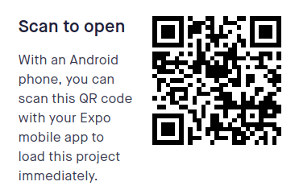

# react-native-steem-signin

Steem SignIn for react native applications With SteemConnet V2

<p align="center"> 

</p>

<strong>Note</strong>: Demo above includes debug text to confirm signin (i.e. user name, expires time and access token). 
<SteemConnect />, by default, will only display the native 'Sign in with Steem' button.


# Setup

```
npm install --save react-native-steem-signin

or

yarn add react-native-steem-signin

```

### Create .env file and fill the env vars:

```
LOGIN_URL=
CALLBACK_URL=
```

 * <strong>CALLBACK_URL</strong>: This is the URL that users will be redirected to after interacting with SC2. It must be listed in the "Redirect URI(s)" list in the app settings EXACTLY the same as it is specified here.
 
 * <strong>LOGIN_URL</strong>: URL that you can redirect the user to so that they may log in to your app through SC2.
 
 <strong>Note</strong> : You can generate LOGIN_URL with 
 <a href="https://github.com/steemit/steemconnect-sdk"> steemconnect sdk</a>

```
var link = api.getLoginURL(state);
console.log(link)
// => https://steemconnect.com/oauth2/authorize?client_id=[app]&redirect_uri=[callbackURL]&scope=vote,comment&state=[state]
```


# Usage 

```
import React, { Component } from 'react'
import { Text, View } from 'react-native'
import SteemConnect from 'react-native-steem-signin'

export default class SteemSignIn extends Component {
  render() {
    return (
      <SteemConnect />
          btnWidth= 180
          btnWidth= 80 
          textSize: 22
          onLoggedIn={this._signIn}        
    );
  }
}
```


# Demo 

<p align="center"> 

</p>

<a href="https://exp.host/@karimation/steem-sign-in-component">Expo Link</a>


# Author

kerim selmi <a href="http://www.karimation.com">karimation</a>

# License

This project is licensed under the  <a href="LICENSE">MIT License</a>