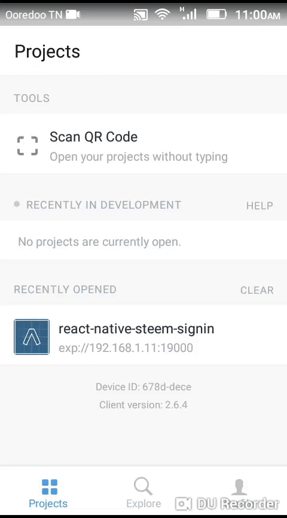

# react-native-steem-signin

Steem SignIn for react native applications With SteemConnet V2

<p align="center"> 

</p>


# Demo 

 <a href="https://exp.host/@karimation/steem-sign-in-component">Expo Link</a>


# Installation


### Create .env file and fill the env vars:

 * CALLBACK_URL: This is the URL that users will be redirected to after interacting with SC2. It must be listed in the "Redirect URI(s)" list in the app settings EXACTLY the same as it is specified here.
 * LOGIN_URL: URL that you can redirect the user to so that they may log in to your app through SC2.

```
LOGIN_URL=
CALLBACK_URL=
```

* example

```
LOGIN_URL=https://v2.steemconnect.com/oauth2/authorize?client_id=steemitgram ***
CALLBACK_URL=http://localhost:2000/api/auth/login/ 
```
# Author

kerim selmi <a href="http://www.karimation.com">karimation</a>

# License

This project is licensed under the  <a href="LICENSE">MIT License</a>